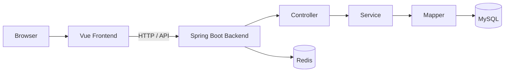

# Repair Work Order System

> **老旧小区公共基础设施检修工单管理系统**  
> Maintenance & Inspection Work Order Management System

面向社区公共基础设施报修、检修与工单流转场景的 B/S 管理系统。项目采用前后端分离架构，围绕住户报修、维修处理、安全巡检、公告、投诉评价、楼栋房屋及设备管理等业务模块，实现多角色协同的工单管理流程。

## 技术栈

| 层级 | 技术 |
| --- | --- |
| Frontend | Vue 2.6.10、Ant Design Vue 1.5.2、Vue Router、Vuex、Axios、ECharts |
| Backend | Java 8、Spring Boot 2.1.0、MyBatis-Plus |
| Database | MySQL |
| Cache | Redis / Jedis |
| Authentication | Apache Shiro、JWT |
| Build | Maven、Webpack |
| Other | MinIO、Quartz |

## 系统架构



## 核心功能

- **报修与工单**：维修申请、工单处理及维修记录管理
- **安全巡检**：公共设施安全检查与巡检信息管理
- **住户与房屋**：住户、房屋、楼栋等基础信息管理
- **设备管理**：社区公共设施设备信息维护
- **公告管理**：社区公告发布与信息维护
- **投诉与评价**：投诉信息及维修评价管理
- **文件管理**：业务附件与文件上传相关功能
- **系统管理**：用户、角色、菜单、日志等后台管理能力

## 项目结构

```text
.
├─ backend/                 # Spring Boot 后端
├─ frontend/                # Vue 前端
├─ db/                      # 数据库相关文件
├─ Redis/                   # Redis 相关资源
└─ residential_order_cos.sql # 数据库初始化 SQL
```

## 主要后端模块

代码中已实现的业务 Controller 包括：

- `RepairInfoController`：维修 / 报修信息
- `SafetyInspectionController`：安全巡检
- `BuildingInfoController`：楼栋信息
- `HousesInfoController`：房屋信息
- `OwnerInfoController`：住户信息
- `DeviceInfoController`：设备信息
- `BulletinInfoController`：公告信息
- `ComplaintInfoController`：投诉信息
- `EvaluateInfoController`：评价信息
- `FileController`：文件处理

## 快速启动

### 环境要求

- JDK 8
- Maven
- Node.js / npm
- MySQL
- Redis

### 数据库

导入根目录中的：

```text
residential_order_cos.sql
```

并根据本地环境修改后端数据库与 Redis 配置。

> 请勿将数据库密码、Token、AccessKey 等敏感配置提交到公开仓库。

### 后端

```bash
cd backend
mvn clean package
mvn spring-boot:run
```

### 前端

```bash
cd frontend
npm install
npm run dev
```

## 项目亮点

- 前后端分离的 Web 应用架构
- Spring Boot + MyBatis-Plus 业务分层设计
- 基于 Shiro + JWT 的权限认证基础
- MySQL 业务数据持久化与 Redis 支持
- 覆盖维修、巡检、评价、投诉等社区业务流程
- ECharts 数据可视化能力

## Future Improvements

- Docker 容器化部署
- Swagger / OpenAPI 接口文档
- 自动化测试与 CI/CD
- 日志与可观测性增强
- AI 辅助工单分类与问题推荐

## Disclaimer

This repository is used for academic and portfolio purposes.
